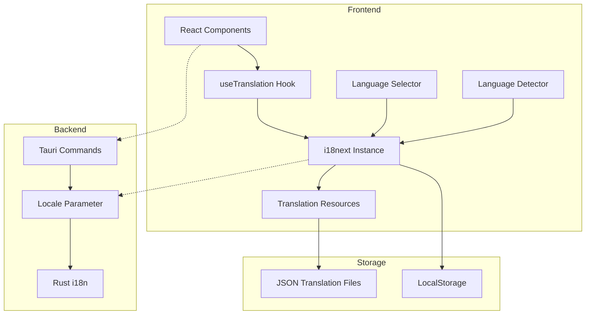
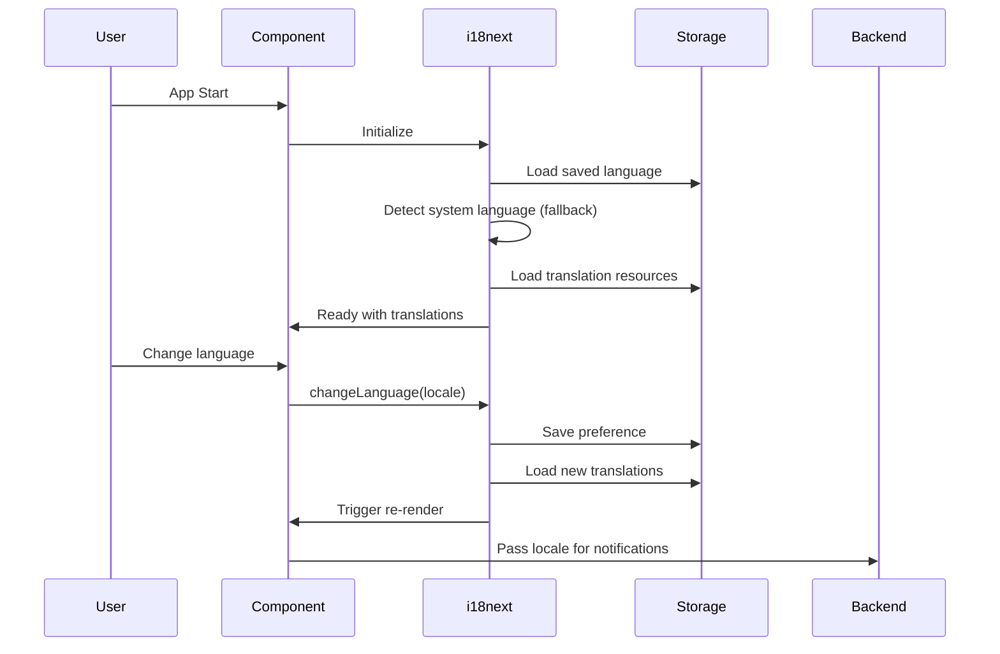

# Design Document: Internationalization

## Overview

This design implements internationalization (i18n) support for the Notly application using the [i18next](https://www.i18next.com/) and [react-i18next](https://react.i18next.com/) libraries. The system will support Japanese and English languages with the ability to easily add more languages in the future. The implementation focuses on type safety, performance, and developer experience while maintaining the app's simplicity and speed.

Key design decisions:
- Use i18next ecosystem (industry standard with excellent TypeScript support)
- Store translations in JSON files organized by namespace
- Implement lazy loading for optimal performance
- Provide type-safe translation keys using TypeScript
- Support both frontend (React) and backend (Rust) localization

## Architecture

### High-Level Architecture



### Component Interaction Flow



## Components and Interfaces

### 1. i18n Configuration Module

**Location**: `src/lib/i18n.ts`

**Responsibilities**:
- Initialize i18next with configuration
- Set up language detection
- Configure translation resources
- Provide TypeScript type definitions

**Interface**:
```typescript
// i18n configuration
interface I18nConfig {
  fallbackLng: string;
  supportedLngs: string[];
  defaultNS: string;
  ns: string[];
  interpolation: {
    escapeValue: boolean;
  };
}

// Initialize i18n
function initI18n(): Promise<void>;

// Get current language
function getCurrentLanguage(): string;

// Change language
function changeLanguage(lng: string): Promise<void>;
```

### 2. Translation Resources

**Location**: `src/locales/{locale}/{namespace}.json`

**Structure**:
```
src/locales/
├── en/
│   ├── common.json
│   ├── editor.json
│   ├── settings.json
│   ├── activity.json
│   └── errors.json
└── ja/
    ├── common.json
    ├── editor.json
    ├── settings.json
    ├── activity.json
    └── errors.json
```

**Namespace Organization**:
- `common`: Shared UI elements (buttons, labels, navigation)
- `editor`: Editor-specific text (toolbar, formatting)
- `settings`: Settings page content
- `activity`: Activity tracking and streaks
- `errors`: Error messages and notifications

### 3. Language Selector Component

**Location**: `src/components/settings/LanguageSelector.tsx`

**Responsibilities**:
- Display available languages
- Handle language selection
- Persist language preference
- Trigger UI updates

**Interface**:
```typescript
interface LanguageSelectorProps {
  className?: string;
}

interface Language {
  code: string;
  name: string;
  nativeName: string;
}

const SUPPORTED_LANGUAGES: Language[] = [
  { code: 'en', name: 'English', nativeName: 'English' },
  { code: 'ja', name: 'Japanese', nativeName: '日本語' }
];
```

### 4. Translation Hook Wrapper

**Location**: `src/hooks/useTranslation.ts`

**Responsibilities**:
- Provide type-safe access to translations
- Wrap react-i18next's useTranslation hook
- Support interpolation and pluralization

**Interface**:
```typescript
// Type-safe translation hook
function useTranslation(ns?: string | string[]): {
  t: TFunction;
  i18n: i18n;
  ready: boolean;
};

// Translation function with type safety
type TFunction = (key: string, options?: object) => string;
```

### 5. Backend Locale Support

**Location**: `src-tauri/src/i18n/`

**Responsibilities**:
- Provide localized messages from Rust backend
- Support error message translation
- Handle notification localization

**Interface**:
```rust
// Rust i18n module
pub struct I18n {
    locale: String,
    translations: HashMap<String, HashMap<String, String>>,
}

impl I18n {
    pub fn new(locale: &str) -> Self;
    pub fn t(&self, key: &str) -> String;
    pub fn t_with_args(&self, key: &str, args: HashMap<String, String>) -> String;
}

// Tauri command to set locale
#[tauri::command]
pub fn set_locale(locale: String, state: State<AppState>) -> Result<(), String>;
```

## Data Models

### Translation Resource Schema

```typescript
// Type definition for translation resources
interface TranslationResource {
  [key: string]: string | TranslationResource;
}

// Example: common.json
interface CommonTranslations {
  app: {
    name: string;
    description: string;
  };
  actions: {
    save: string;
    cancel: string;
    delete: string;
    edit: string;
    create: string;
  };
  navigation: {
    notes: string;
    folders: string;
    tags: string;
    settings: string;
    activity: string;
  };
}
```

### Language Preference Storage

```typescript
// LocalStorage key
const LANGUAGE_KEY = 'notly_language';

// Storage interface
interface LanguagePreference {
  locale: string;
  timestamp: number;
}

// Save preference
function saveLanguagePreference(locale: string): void {
  localStorage.setItem(LANGUAGE_KEY, JSON.stringify({
    locale,
    timestamp: Date.now()
  }));
}

// Load preference
function loadLanguagePreference(): string | null {
  const stored = localStorage.getItem(LANGUAGE_KEY);
  if (!stored) return null;
  const pref: LanguagePreference = JSON.parse(stored);
  return pref.locale;
}
```

## Correctness Properties

*A property is a characteristic or behavior that should hold true across all valid executions of a system—essentially, a formal statement about what the system should do. Properties serve as the bridge between human-readable specifications and machine-verifiable correctness guarantees.*

### Property 1: Language Detection and Fallback

*For any* system language setting, when the app initializes, if the system language is supported then that language should be set as default, otherwise English should be set as the fallback language.

**Validates: Requirements 1.1, 1.2**

### Property 2: Translation Key Lookup

*For any* translation key and locale, when requesting a translation, if the key exists in the current locale then that translation should be returned, otherwise if the key exists in the fallback locale then the fallback translation should be returned, otherwise the key itself should be returned.

**Validates: Requirements 2.2, 2.3, 2.4**

### Property 3: Language Persistence Round-Trip

*For any* supported language, when a user selects that language, saves it, and restarts the app, the app should load with the same language selected.

**Validates: Requirements 1.5**

### Property 4: UI Update Consistency

*For any* language change, all visible UI components should display text in the newly selected language after the change completes.

**Validates: Requirements 1.4, 3.2**

### Property 5: Translation Interpolation

*For any* translation with variables, when providing values for those variables, the returned string should contain the interpolated values in the correct positions.

**Validates: Requirements 3.3**

### Property 6: Namespace Organization

*For any* translation key, it should be accessible through its designated namespace, and keys should not conflict across different namespaces.

**Validates: Requirements 2.5**

### Property 7: Type Safety

*For any* translation key used in TypeScript code, if the key does not exist in the translation files, the TypeScript compiler should produce a type error.

**Validates: Requirements 7.2**

### Property 8: Performance Constraint

*For any* language switch operation, the time from initiating the change to completing the UI update should be less than 100ms.

**Validates: Requirements 6.3**

### Property 9: Pluralization Support

*For any* translation with pluralization rules and any count value, the returned string should use the correct plural form according to the language's pluralization rules.

**Validates: Requirements 3.4**

### Property 10: Locale-Specific Date Formatting

*For any* date value and locale, when formatting the date, the result should follow the date format conventions of that locale.

**Validates: Requirements 3.5**

### Property 11: Backend Locale Consistency

*For any* backend operation (notification or error), when the frontend has a selected language, the backend should return messages in that same language.

**Validates: Requirements 5.1, 5.2**

### Property 12: Lazy Loading Behavior

*For any* language selection, only the translations for that language should be loaded initially, and additional namespaces should be loaded on demand when accessed.

**Validates: Requirements 6.1, 6.5**

### Property 13: Translation Caching

*For any* translation that has been loaded once, subsequent requests for the same translation should be served from cache without reloading.

**Validates: Requirements 6.2**

### Property 14: Development Warning Logging

*For any* missing translation key during development mode, a warning should be logged to the console indicating which key is missing.

**Validates: Requirements 7.4**

## Error Handling

### Translation Missing

**Scenario**: Translation key not found in any locale

**Handling**:
1. Return the translation key itself as visible indicator
2. Log warning in development mode
3. Do not crash the application
4. Display fallback language if available

```typescript
function handleMissingTranslation(key: string, locale: string): string {
  if (process.env.NODE_ENV === 'development') {
    console.warn(`Missing translation: ${key} for locale: ${locale}`);
  }
  return key; // Return key as fallback
}
```

### Language Loading Failure

**Scenario**: Failed to load translation resources

**Handling**:
1. Retry loading once
2. Fall back to English if retry fails
3. Show user-friendly error message
4. Allow app to continue with fallback language

```typescript
async function loadLanguageWithRetry(locale: string): Promise<void> {
  try {
    await i18next.changeLanguage(locale);
  } catch (error) {
    console.error(`Failed to load language: ${locale}`, error);
    try {
      await i18next.changeLanguage('en'); // Fallback
    } catch (fallbackError) {
      console.error('Failed to load fallback language', fallbackError);
      // Continue with whatever is loaded
    }
  }
}
```

### Invalid Locale

**Scenario**: User attempts to select unsupported language

**Handling**:
1. Validate locale against supported languages list
2. Reject invalid locales
3. Keep current language unchanged
4. Show error message to user

```typescript
function validateLocale(locale: string): boolean {
  return SUPPORTED_LANGUAGES.some(lang => lang.code === locale);
}

function changeLanguageSafely(locale: string): Promise<void> {
  if (!validateLocale(locale)) {
    throw new Error(`Unsupported locale: ${locale}`);
  }
  return i18next.changeLanguage(locale);
}
```

### Backend Locale Mismatch

**Scenario**: Frontend and backend locales out of sync

**Handling**:
1. Always pass current locale to backend commands
2. Backend validates locale and falls back to English if invalid
3. Log synchronization issues
4. Ensure notifications use correct language

```rust
pub fn validate_locale(locale: &str) -> String {
    match locale {
        "en" | "ja" => locale.to_string(),
        _ => {
            eprintln!("Invalid locale: {}, falling back to en", locale);
            "en".to_string()
        }
    }
}
```

## Testing Strategy

### Unit Tests

Unit tests will verify specific examples and edge cases:

1. **Language Detection**:
   - Test system language detection with supported languages
   - Test fallback to English for unsupported languages
   - Test explicit language selection overrides detection

2. **Translation Lookup**:
   - Test successful translation retrieval
   - Test fallback language when key missing in current locale
   - Test key return when missing in all locales
   - Test nested key access

3. **Interpolation**:
   - Test variable substitution in translations
   - Test multiple variables
   - Test missing variables handling

4. **Persistence**:
   - Test saving language preference to localStorage
   - Test loading language preference on app start
   - Test handling corrupted localStorage data

5. **Component Integration**:
   - Test LanguageSelector component rendering
   - Test language change triggers re-render
   - Test translation hook in components

### Property-Based Tests

Property-based tests will verify universal properties across all inputs using [fast-check](https://fast-check.dev/) library. Each test will run a minimum of 100 iterations.

1. **Property 1: Language Detection and Fallback** (Requirements 1.1, 1.2)
   - Generate random system locales
   - Verify supported locales are selected
   - Verify unsupported locales fall back to English

2. **Property 2: Translation Key Lookup** (Requirements 2.2, 2.3, 2.4)
   - Generate random translation keys
   - Verify correct locale translation returned when exists
   - Verify fallback locale used when current locale missing
   - Verify key returned when missing in all locales

3. **Property 3: Language Persistence Round-Trip** (Requirements 1.5)
   - Generate random supported languages
   - Verify save then load returns same language

4. **Property 4: UI Update Consistency** (Requirements 1.4, 3.2)
   - Generate random language changes
   - Verify all components update to new language

5. **Property 5: Translation Interpolation** (Requirements 3.3)
   - Generate random translation templates with variables
   - Generate random variable values
   - Verify interpolated strings contain all values

6. **Property 6: Namespace Organization** (Requirements 2.5)
   - Generate random namespaces and keys
   - Verify keys accessible through correct namespace
   - Verify no key conflicts across namespaces

7. **Property 7: Type Safety** (Requirements 7.2)
   - This will be verified through TypeScript compilation
   - Invalid keys should fail at compile time

8. **Property 8: Performance Constraint** (Requirements 6.3)
   - Generate random language switches
   - Measure time from change to completion
   - Verify all switches complete within 100ms

9. **Property 9: Pluralization Support** (Requirements 3.4)
   - Generate random count values
   - Verify correct plural forms for each language
   - Test edge cases (0, 1, 2, many)

10. **Property 10: Locale-Specific Date Formatting** (Requirements 3.5)
    - Generate random dates
    - Verify formatting matches locale conventions
    - Test both Japanese and English formats

11. **Property 11: Backend Locale Consistency** (Requirements 5.1, 5.2)
    - Generate random backend operations
    - Verify messages match frontend locale
    - Test notifications and errors

12. **Property 12: Lazy Loading Behavior** (Requirements 6.1, 6.5)
    - Verify only selected language loaded initially
    - Verify namespaces loaded on demand
    - Test multiple namespace loading scenarios

13. **Property 13: Translation Caching** (Requirements 6.2)
    - Load translations multiple times
    - Verify subsequent loads use cache
    - Measure cache hit rate

14. **Property 14: Development Warning Logging** (Requirements 7.4)
    - Generate random missing keys
    - Verify warnings logged in development mode
    - Verify no warnings in production mode

### Integration Tests

1. **End-to-End Language Switch**:
   - Start app with default language
   - Navigate to settings
   - Change language
   - Verify all pages reflect new language
   - Restart app
   - Verify language persisted

2. **Backend Integration**:
   - Trigger backend notification
   - Verify notification in correct language
   - Change language
   - Trigger another notification
   - Verify new notification in new language

3. **Error Scenarios**:
   - Simulate missing translation files
   - Verify graceful degradation
   - Simulate corrupted localStorage
   - Verify app still loads

### Test Configuration

```typescript
// vitest.config.ts additions for i18n testing
export default defineConfig({
  test: {
    globals: true,
    environment: 'happy-dom',
    setupFiles: ['./src/test/setup.ts'],
    coverage: {
      include: ['src/lib/i18n.ts', 'src/hooks/useTranslation.ts'],
      threshold: {
        lines: 80,
        functions: 80,
        branches: 80,
        statements: 80
      }
    }
  }
});
```

### Property Test Example

```typescript
import fc from 'fast-check';
import { describe, it, expect } from 'vitest';

describe('Property 2: Translation Key Lookup', () => {
  it('should return correct translation for valid keys', () => {
    fc.assert(
      fc.property(
        fc.constantFrom('en', 'ja'), // locale
        fc.constantFrom('common', 'editor', 'settings'), // namespace
        fc.string(), // key
        (locale, namespace, key) => {
          // Test implementation
          const translation = t(`${namespace}:${key}`, { lng: locale });
          // Verify translation logic
          expect(typeof translation).toBe('string');
        }
      ),
      { numRuns: 100 }
    );
  });
});
```

## Implementation Notes

### Dependencies to Add

```json
{
  "dependencies": {
    "i18next": "^24.3.0",
    "react-i18next": "^16.2.0",
    "i18next-browser-languagedetector": "^8.0.2"
  },
  "devDependencies": {
    "fast-check": "^3.24.0"
  }
}
```

### TypeScript Configuration

Enable strict type checking for i18n:

```typescript
// src/types/i18next.d.ts
import 'i18next';
import common from '../locales/en/common.json';
import editor from '../locales/en/editor.json';
import settings from '../locales/en/settings.json';
import activity from '../locales/en/activity.json';
import errors from '../locales/en/errors.json';

declare module 'i18next' {
  interface CustomTypeOptions {
    defaultNS: 'common';
    resources: {
      common: typeof common;
      editor: typeof editor;
      settings: typeof settings;
      activity: typeof activity;
      errors: typeof errors;
    };
  }
}
```

### Performance Optimizations

1. **Lazy Loading**: Load translation namespaces only when needed
2. **Caching**: Cache loaded translations in memory
3. **Bundle Splitting**: Separate translation files from main bundle
4. **Preloading**: Preload common namespace on app start

### Rust Backend Implementation

For backend localization, use a simple HashMap-based approach:

```rust
// src-tauri/src/i18n/mod.rs
use std::collections::HashMap;
use serde_json::Value;

pub struct I18n {
    locale: String,
    translations: HashMap<String, Value>,
}

impl I18n {
    pub fn new(locale: &str) -> Self {
        let translations = load_translations(locale);
        Self {
            locale: locale.to_string(),
            translations,
        }
    }
    
    pub fn t(&self, key: &str) -> String {
        self.translations
            .get(key)
            .and_then(|v| v.as_str())
            .unwrap_or(key)
            .to_string()
    }
}

fn load_translations(locale: &str) -> HashMap<String, Value> {
    // Load from embedded JSON files
    let json_str = match locale {
        "ja" => include_str!("../../locales/ja/backend.json"),
        _ => include_str!("../../locales/en/backend.json"),
    };
    serde_json::from_str(json_str).unwrap_or_default()
}
```
