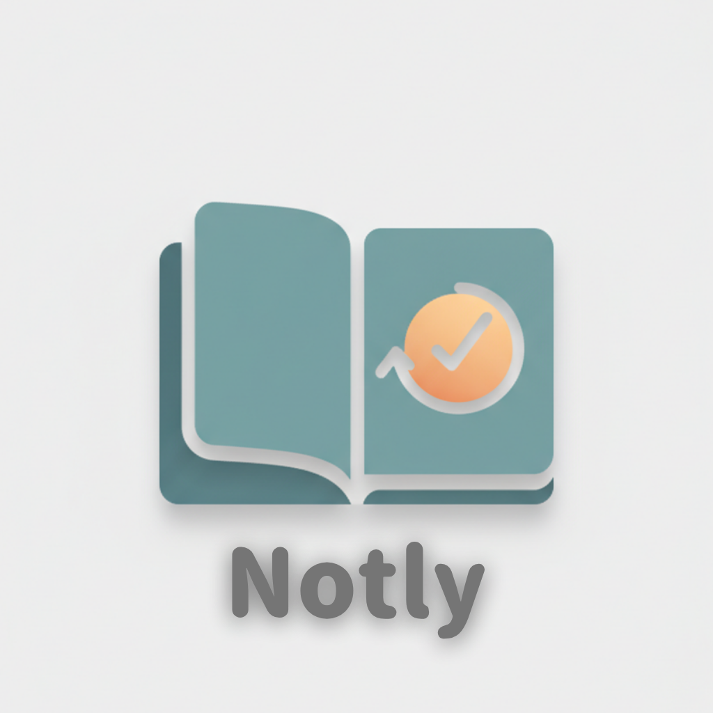

# Notly



**A simple desktop app to build the habit of writing notes**

[](https://opensource.org/licenses/MIT)
[](https://www.typescriptlang.org/)
[](https://nextjs.org/)
[](https://www.electronjs.org/)

---

## 📝 Overview

**Notly** is a desktop application specifically designed to help you build the habit of writing notes and journals. While existing note apps are often too complex with excessive features, Notly provides only the essential functionality to let you focus on "writing."

### Key Features

- 🎯 **Habit-focused** - Streak tracking and notifications to support consistency
- 📁 **Simple note management** - Organize with folders and tags
- ✍️ **Markdown support** - Comfortable writing experience
- 🔗 **Note linking** - Connect notes with `[[Note Name]]`
- 📊 **Statistics** - Visualize your writing days and note count
- 💾 **Local storage** - All data is stored on your PC
- 🎨 **Templates** - Create templates for frequently used formats

---

## 🚀 Setup

### Prerequisites

- **Node.js** 18 or higher
- **npm** or **pnpm**

### Installation

```bash
# Clone the repository
git clone https://github.com/yourusername/notly.git
cd notly

# Install dependencies
pnpm install

# Setup Prisma
npx prisma generate
npx prisma migrate dev --name init
```

### Run in Development

```bash
# Start development server
pnpm run dev
```

This will start:

- Next.js development server (http://localhost:3000)
- Electron app

### Build

```bash
# Build the app
pnpm run build

# Create distribution package
pnpm run dist

# Platform-specific builds
pnpm run dist:mac    # For macOS
pnpm run dist:win    # For Windows
pnpm run dist:linux  # For Linux
```

---

## 📦 Tech Stack

### Frontend

- **Next.js 15.5** - React framework
- **TypeScript** - Type-safe development
- **Tailwind CSS** - Styling
- **shadcn/ui** - UI components

### Desktop

- **Electron 38** - Desktop application framework

### Database

- **Prisma** - ORM
- **SQLite** - Local database

### Others

- **Markdown** - Note format
- **ESLint** - Code quality
- **Prettier** - Code formatting

---

## 📁 Project Structure

```
notly/
├── src/
│   ├── app/              # Next.js App Router
│   ├── components/       # React components
│   ├── electron/         # Electron main process
│   │   ├── main.ts
│   │   ├── preload.ts
│   │   ├── database.ts
│   │   └── handlers/     # IPC handlers
│   ├── hooks/            # Custom hooks
│   ├── types/            # Type definitions
│   └── lib/              # Utilities
├── prisma/
│   └── schema.prisma     # Database schema
├── public/               # Static files
└── dist/                 # Build output
```

---

## 🎯 Features

### Phase 1: MVP (Currently in Development)

- [x] Basic note creation and editing
- [x] Markdown support
- [x] Folder functionality
- [x] Local storage
- [x] Auto-save
- [ ] Template selection UI

### Phase 2: Habit Building Features

- [ ] Notification system
- [ ] Streak display
- [ ] Statistics

### Phase 3: Advanced Features

- [ ] `[[]]` linking functionality
- [ ] Template system
- [ ] Tag functionality
- [ ] Search functionality

### Phase 4: Refinement & Optimization

- [ ] UI/UX refinement
- [ ] Performance optimization
- [ ] Backup & export functionality

---

## 🗂️ Data Storage Location

Notly stores data in the following locations:

### macOS

```
~/Notly/
├── notes/          # Markdown files
├── templates/      # Templates
└── .metadata/
    └── app.db      # SQLite database
```

### Windows

```
C:\Users\<username>\Notly\
├── notes/
├── templates/
└── .metadata\
    └── app.db
```

### Linux

```
~/Notly/
├── notes/
├── templates/
└── .metadata/
    └── app.db
```

---

## 🔧 Development

### Available Scripts

```bash
# Development
pnpm run dev              # Start development server
pnpm run dev:next         # Start Next.js only
pnpm run dev:electron     # Start Electron only

# Build
pnpm run build            # Full build
pnpm run build:next       # Build Next.js
pnpm run build:electron   # Build Electron

# Database
pnpm run db:migrate       # Run migrations
pnpm run db:generate      # Generate Prisma Client
pnpm run db:studio        # Open Prisma Studio
pnpm run db:push          # Push schema to DB

# Code Quality
pnpm run lint             # Run ESLint
pnpm run type-check       # Type checking

# Distribution
pnpm run dist             # Create distribution package
pnpm run dist:mac         # For macOS
pnpm run dist:win         # For Windows
pnpm run dist:linux       # For Linux
```

### Database Testing

```bash
# Create test data
pnpx ts-node src/electron/test-db.ts
```

---

## 🎨 Customization

### Theme

You can choose from `light`, `dark`, or `system` themes in the settings.

### Creating Templates

You can create custom templates within the app. The following default templates are provided:

- **Daily Note** - For journaling
- **Meeting Notes** - For meeting records
- **Ideas** - For capturing thoughts
- **TODO** - For task management
- **Reflection** - For weekly/monthly reviews

---

## 📄 License

This project is licensed under the [MIT License](./LICENSE).

---

## 🤝 Contributing

Contributions are welcome! Please follow these steps:

1. Fork this repository
2. Create a feature branch (`git checkout -b feature/AmazingFeature`)
3. Commit your changes (`git commit -m 'Add some AmazingFeature'`)
4. Push to the branch (`git push origin feature/AmazingFeature`)
5. Create a Pull Request

### Development Guidelines

- Always use TypeScript type definitions
- Follow ESLint rules
- Write clear commit messages
- Add appropriate documentation for new features

---

## 📞 Support

If you encounter any issues, you can get support through:

- 🐛 [Issue Tracker](https://github.com/yourusername/notly/issues)
- 💬 [Discussions](https://github.com/yourusername/notly/discussions)
- 📧 Email: support@notly.app (placeholder)

---

## 🙏 Acknowledgments

This project is powered by the following open-source projects:

- [Electron](https://www.electronjs.org/)
- [Next.js](https://nextjs.org/)
- [Prisma](https://www.prisma.io/)
- [Tailwind CSS](https://tailwindcss.com/)
- [shadcn/ui](https://ui.shadcn.com/)

---

## 📚 Documentation

For detailed documentation, see the [docs/](./docs/) folder:

- [Setup Guide](./docs/setup.md)
- [API Design](./docs/api-design.md)
- [Architecture](./docs/architecture.md)
- [Contributing Guide](./docs/contributing.md)

---

**Start your writing habit with Notly** ✍️

Made with ❤️ by [Your Name]
